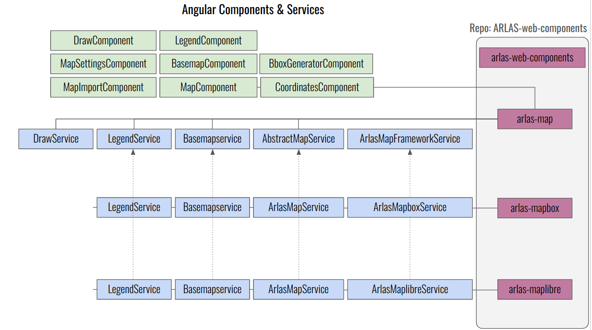

[](https://travis-ci.org/gisaia/ARLAS-web-components)
[](https://badge.fury.io/js/arlas-web-components)

# About this repo:

This repository contains 4 Angular libraries and one demo Angular application.

The 4 libraries are:
- **arlas-web-components**: contains a set of graphical component to explore data such as : donuts, histograms, powerbars, resultlits, metrics, metrics table,..
- **arlas-map**: contains one map component dedicated to display ARLAS data. This component is cartographical-framework-free. The libarary also comes with a number of services. Those services provide cartographical interfaces that should be implemented according to your chosen map framework.
- **arlas-maplibre**: this library provides a maplibregl implementation of the arlas-map library.
- **arlas-mapbox**: this library provides a maboxgl implementation of the arlas-map library.

> Note 1: **arlas-maplibre** and **arlas-mapbox** both have **arlas-map** as a dependency.

> Note 2: As a consequence, install **arlas-maplibre** or **arlas-mapbox** directly without the need of installing **arlas-map** precedently.


The demo application has view composed of several tabs. Each tab provides an example of one component of **arlas-web-components** library or an implementation of **arlas-map** library.

## Artchitecture of **arlas-map**, **arlas-maplibre** and **arlas-mapbox**



- **arlas-map** provides the Angular components to be used in your apps.
- **arlas-map** components logic is declared in different services. Some are implemented when they don't depend directly on a cartographical framework. The rest are declared as abstract.
- The mapboxgl-js (v1.13) and maplibregl-js implementations are respectively coded in **arlas-mapbox** and **arlas-maplibre** libraries.


# Install

To install these libraries in your npm Angular web app project add the dependency in your package.json :

For arlas-web-components:
```shell
$ npm install --save arlas-web-components
```

For arlas-map:
```shell
$ npm install --save arlas-maplibre
```
Or
```shell
$ npm install --save arlas-mapbox
```

# Build

## Prequesites:

To build the projects you need to have installed
- [Node](https://nodejs.org/en/) version ^20.0.0 
- [npm](https://github.com/npm/npm) version ^10.0.0
- [Angular CLI](https://github.com/angular/angular-cli) version ^18.2.12
  ```
  $ npm install -g @angular/cli@^18.2.12
  ```
## Proceed to build

Clone the project

```shell
$ git clone https://github.com/gisaia/ARLAS-web-components
```

Move to the folder

```shell
$ cd ARLAS-web-components
```

Install all the projects dependencies

```shell
$ npm install
```

Build the project with `ng` :

For arlas-web-components
```shell
$ npm run build-components
```

For arlas-map
```shell
$ npm run build-map
```

For arlas-maplibre
```shell
$ npm run build-maplibre
```


For arlas-mapbox
```shell
$ npm run build-mapbox
```

The build artifacts will be generated in the `dist/` directory. 


## Run 

Check out the ARLAS web components by running the demo application of this library on a dev server  :

```shell
$ ng serve 
```

Navigate to [http://localhost:4200/](http://localhost:4200/).

 The app will automatically reload if you change any of the source files.

## Unit tests

```shell
$ ng test
```

## Contributing

- Please read [CONTRIBUTING.md](CONTRIBUTING.md) for details on our code of conduct, and the process for submitting pull requests to us.

## Versioning

We use our own `x.y.z` versioning schema, where :

- `x` : Incremented as soon as the `ARLAS-server API` changes
- `y` : Incremented as soon as an `ARLAS-web-components` inputs or outputs change.
- `z` : Incremented as soon as the `ARLAS-web-components` implementation receives a fix or an enhancement.

## Authors

- Gisaia - initial work - [Gisaïa](https://gisaia.com/) 

See also the list of [contributors](https://github.com/gisaia/ARLAS-web-components/graphs/contributors) who participated in this project.

## License

These projects are licensed under the Apache License, Version 2.0 - see the [LICENSE.txt](https://github.com/gisaia/ARLAS-web-components/blob/develop/LICENSE.txt) file for details.

## Acknowledgments

This repository has been initiated and is maintained by Gisaïa.
